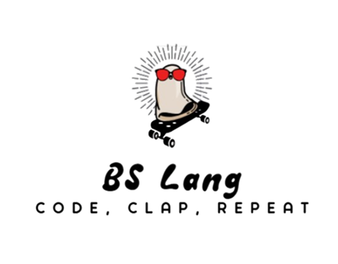

# 📜 BSLang

**BSLang** is a Gen-Z inspired toy programming language designed to be expressive, fun, and functionally capable. With meme-driven syntax and semantics, it aims to make programming both entertaining and educational. You might be thinking why to create a language like this:

> "And behold, the Language was made — not that it should merely run, but that it should *Vibe*..." 
> – *BS Scrolls, Chapter 1: Verse 1*

<p align="center">

</p>

> Because programming should be expressive. It should slay. It should yeet
> – *BS Scrolls, Chapter 9: Verse 9*

## 🚀 Installation Guide for BS-Lang

### 🐧 Linux

1. **Clone the GitHub repo:**

```bash
git clone https://github.com/AnomitraSarkar/BS-Lang.git
cd BS-Lang/SCRIPTS
```

Or just download the executable `bs` file manually into the `SCRIPTS/` directory.

2. **Make it executable:**

```bash
chmod +x bs
```

3. **(Optional) Rename it to `bs`:**

```bash
mv bs-v.*.*.*-linux-x64 bs
```

4. **Move it to a system path:**

```bash
sudo mv ./bs /usr/local/bin/bs
```

Now you can run `bs` from anywhere:

```bash
bs
```

---

### 🪟 Windows

1. **Download the `bs.exe` file** from the `SCRIPTS/` folder in the repo or a release.

2. **(Optional) Rename the file to `bs.exe`** for simplicity.

3. **Add the file's directory to your PATH:**

- Press **Win + R**, type `sysdm.cpl`, press Enter.
- Go to **Advanced** → **Environment Variables**.
- Under **System variables**, find and select `Path`, then click **Edit**.
- Click **New**, and enter the full path to the folder containing `bs.exe`.

4. **Test it in a new terminal:**

```cmd
bs
```

<b><i>Select the executable distribution according to the platform and version : `bs-[version]-[platform]-[architecture]` </i></b>

### Mac (Coming Soon...)

## Working

`BS-Lang\examples` contain example programs to test and run with, refer below in the docs to get used to the programming language.

To check if working or not

```bash
bs -shell
```

To run bs file

```bash
bs <file.bs>
```

To run bs file and print the ast tree and token associated by parser

```bash
bs -ast -token <file.bs>
```

## ✅ Current Functionalities (aka what Delulu can do rn)

### ✨ Core Syntax and Semantics

[View full syntax guide](docs/SYNTAX.md)

- `sigma`: Declare a variable like a sigma male 🧠 — because alpha is too mainstream.
- `cook`: Function declaration — chef mode activated 🍳.
- `gyatt()`: Call a function with max rizz 👑 — ultimate slay.
- `hawk_tuah(...)`: Print it LOUD like your crush just texted back 📢.
- `rizz_check` / `nah_fam`: If you got the rizz, do this; otherwise, hard pass 😎.
- `flex`: Infinite loop flex session 💪 — never stop, won’t stop.
- `yap i till x to y`: For loop that speaks fluent Gen-Z 🧢.
- `yeet`: Return the value straight into the void 🚀.
- `skibidi`: End a function with a little dance-off 🎤.
- `slay`, `cap`: Boolean truths and lies 💅 — certified facts only.
- `frfr`, `maybe`, `nah`: Logic squad — AND, OR, and a full 180 🌀.
- `nvm`, `delulu`, `sus`: Null, undefined, and the imposter among us 🤨.
- `on_read{...}`: Comments with ✨aesthetic✨ — journaling your code.

### 🧠 Tokenization & Lexing

- Support for numbers, strings, identifiers
- Operators and comparisons
- Keywords and emoji-core logic

### 🔁 Control Flow

- Supports recursion like a philosophy major 🤯
- Loops that just keep looping 😵
- Mutating variables like a shapeshifter
- Full arithmetic + logic support

---

## ⚠️ Is BSLang Turing Complete?

Yes... **in theory**. Like that group project teammate who _could_ do everything, but you know they won't 😩

> "BSLang is Turing complete in theory, but in practice she's still working on herself 💅🛠️." 
> – *BS Scrolls, Chapter 8: Verse 8*

So yes — we checked the nerdy boxes ✅ but if you try to build Skynet with it right now, she might just `yeet` herself.

---

## 🔧 Missing Functionalities for Practical Turing Completeness

### ❗ Standard Library (because vibes need functions)

- A standard library is essential to make BSLang usable in practice.
- Math utilities, string manipulation, data structures like lists/maps
- Utility functions: `map`, `filter`, `reduce`, `sort`, `random`
- Standard input/output wrappers
- Time and date support (so we know when to `slay`)

### ❗ Arrays and Memory Extended Functionalities

- Hashmaps and Set etc
- Dynamic arrays and nested structures
- `len(arr)` support and iteration

### ❗ First-Class Functions

- Passing functions as arguments (yes, like actual functions 😭)
- Anonymous functions (bonus points for ✨ aesthetic syntax ✨)

### ❗ Input/Output

- File I/O (optional but 🔥)

### ❗ Interpreter Runtime Buff

- Remove recursion limits
- Allow deep call stacks
- Add tail call optimization (for the real nerds)

### ❗ Error Handling (a.k.a. emotional support)

- `panik` for try/catch semantics
- Null-safe comparisons and default values

### ❗ Optional Vibes

- `eval()` for runtime code gen (yes this is chaotic, we support it)
- Garbage collection
- REPL or live console (so you can vibe-test code live)

---

## 👨‍💻 Created by

[Anomitra Sarkar](https://github.com/AnomitraSarkar)

---

## 🤝 Open Source Vibes

BSLang is totally open source — because gatekeeping isn’t slay. Contributions are welcome whether you want to fix bugs, add features, or just inject more meme magic.

- Found a bug? Squash it like a cap.
- Got a feature idea? Let’s manifest it together.
- Wanna vibe with the code? Fork it, slay it, PR it.

> "Delulu is for the community, by the community, to the community — let's go full frfr." 
> – *BS Scrolls, Chapter 3: Verse 11*

---

## 📄 License

MIT License — free to slay, remix, and ship.

> "Sometimes you gotta cook to go Turing complete byotch." 
> – *BS Scrolls, Chapter 6: Verse 9*

<b> PS: If you encounter an error — To bad, So sad! </b>